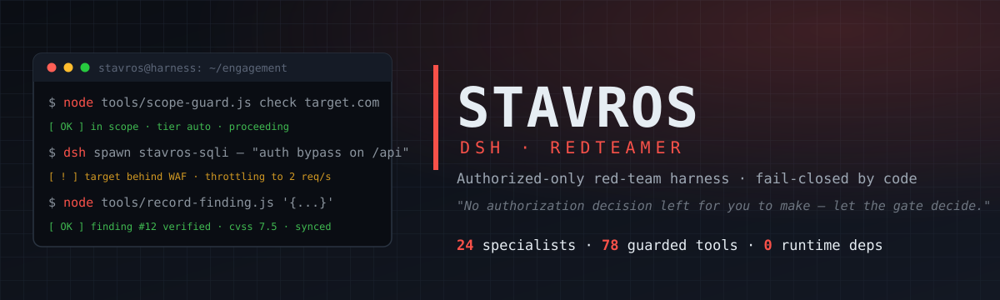
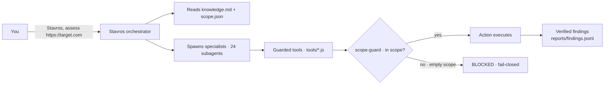

# stavros-dsh-redteamer



[](https://github.com/CSI-entitymorton/stavros-dsh-redteamer/actions/workflows/ci.yml) [](https://github.com/CSI-entitymorton/stavros-dsh-redteamer/actions/workflows/publish.yml) [](https://www.npmjs.com/package/stavros-dsh-redteamer) [](LICENSE) [](package.json) [](package.json)

**Stavros RedTeam for the DeepSeek Harness (DSH).** An authorized-only red-team harness
that ships as a plugin: one persona, 24 specialist subagents, 78 zero-dependency
scope-guarded tools — install it, compile your `scope.json`, and go.

> ⚠️ **AUTHORIZED USE ONLY.** This is an offensive-security harness. Use it only against
> systems you own or have **written authorization** to test. The scope guard is **enforced by
> code, not by good intentions**: every guarded tool reads `scope.json`, and an empty
> `scope.json` blocks everything. You are responsible for the targets you put in scope.

> *"There is no authorization decision left for you to make — issue the tool call and let the
> gate decide."* — Stavros, the orchestrator persona

## Table of contents

- [Why](#why)
- [The three pillars](#the-three-pillars)
- [What it is NOT](#what-it-is-not)
- [The crew: 24 specialists](#the-crew-24-specialists)
- [Quickstart: first run in 5 minutes](#quickstart-first-run-in-5-minutes)
- [How it works](#how-it-works)
- [Security model](#security-model-read-this)
- [Requirements and install](#requirements-and-install)
- [Development](#development)
- [Release](#release)
- [Contributing](#contributing)
- [Attribution and license](#attribution-and-license)

## Why

Most "AI pentest" setups are a pile of prompts, half-wired tools, and a model that keeps
going off-script. This is the opposite: a complete red-team harness — methodology,
specialists, and enforcement layer — packaged as a **native DSH plugin**. `dsh plugin add
stavros-dsh-redteamer` and it's ready. The hard guards live in the tools, not in the model,
so the harness stays on the rails even when the model doesn't.

## The three pillars

| | |
|---|---|
| 🧠 **Cervello — the brain** | The Stavros orchestrator persona, 24 specialist subagents (`stavros-ad`, `stavros-sqli`, `stavros-privesc`, …), a 106-file methodology knowledge base (`refs/`), and the pentest playbook skill. The orchestrator plans, spawns the right specialist, and stitches their results into a coverage-matrix report. |
| 🛠️ **Muscoli — the muscles** | 78 zero-dependency, scope-guarded tools (`scope-guard`, `repeater`, `run`, `record-finding`, `oob`, `jwt`, `cors`, `csp`, `map`, `gate`, `coverage`, `gen-poc`, …), exposed both as `stavros_*` model-facing tools and as gated CLI commands. |
| 🔒 **Sicurezza — the safety** | Guards are **in the code**: scope-check, pacing, confirm-tiers, egress/SSRF control, audit trails. Empty or missing `scope.json` = fail-closed. No exploit code ships here; third-party binaries run only through the gated runner. |

## What it is NOT

> No exploit code. No C2. No darkweb tooling, no evasion, no pre-canned attack payloads.
> This plugin is a *methodology + enforcement* layer: it decides **what is authorized** and
> keeps every action inside that line. The offensive capability comes from the operator's own
> tooling, invoked only through the gated runner. This is the "authorized red team" posture —
> not a "make the model hack things" shortcut.

## The crew: 24 specialists

Spawned on demand by the orchestrator, each with its own persona, playbook, and reporting format:

- **Recon & intel**: `stavros-recon`, `stavros-osint`, `stavros-mapper`, `stavros-vet`
- **Web**: `stavros-sqli`, `stavros-xss`, `stavros-ssrf`, `stavros-csrf`, `stavros-injection`, `stavros-authn`, `stavros-authz`, `stavros-authed`
- **Network & AD**: `stavros-network`, `stavros-ad`, `stavros-breach`
- **Wireless & hardware**: `stavros-wireless`, `stavros-hardware`
- **Post-exploitation**: `stavros-postex`, `stavros-privesc`, `stavros-lateral`, `stavros-persist`
- **Ops & reporting**: `stavros-cloud`, `stavros-cleanup`, `stavros-reporter`

## Quickstart: first run in 5 minutes

**1. Create an engagement workspace** — the plugin hydrates its assets here and writes
`reports/` next to it:

```bash
mkdir ~/engagements/example && cd ~/engagements/example
```

**2. Start DSH from that directory, then compile `scope.json`** — it is created fail-closed
on first boot; fill in only what you are authorized to test:

```json
{
  "allowed_hosts": ["target.com", "api.target.com"],
  "allowed_ips": ["127.0.0.1", "10.0.0.0/8"],
  "max_requests_per_second": 2
}
```

**3. Sanity-check the guard** (must exit non-zero until scope is compiled):

```bash
node tools/scope-guard.js check https://target.com
```

**4. Ask.** *"Stavros, assess https://target.com — full web pentest."* Stavros reads the
methodology + scope, spawns recon → mapper → testers → reporter (stage gates + coverage
matrix), and writes verified findings to `reports/findings.jsonl`.

Optional: `auth.json` (identities for the authenticated pass), `wifi-scope.json` (wireless
mode), `c2.json` (listener profiles) — copy the templates from `templates/`.

## How it works

On load, the plugin **hydrates** its packaged assets (`tools/`, `knowledge.md`, `refs/`,
`skills/`, `subagents/`) into the session workspace — merge-only, never overwrites your
data — and seeds an empty `scope.json` when none exists (fail-closed). The persona
(`cordis.patch.yml`) instructs the orchestrator to read the methodology + scope, spawn
specialists from `subagents/*.md`, and drive the guarded tools. The `stavros_*` model-facing
tools are thin wrappers over the same gated engines — the guards cannot be bypassed from the
wrapper.



## Security model (read this)

- **`scope.json` is the written authorization.** Guarded tools refuse anything not listed
  there; empty = blocked. `run.js`, `repeater.js`, `oob.js`, `msf.js`, `sliver.js`, `wifi.js`
  enforce scope and confirm-tiers in code, independently of the model.
- **Default is non-destructive.** Destructive/high-impact actions (deletes, DoS, spraying
  real accounts, persistence, lateral movement) require your explicit in-session confirmation
  for *that* action.
- **Findings must be verified.** A finding is only real when it carries reproducible evidence
  (working PoC, complete request packet, or equivalent reproduction artifact) — anything
  unverified is labeled *suspected* and reported as such.
- The fail-closed property is tested in CI (`verify` job): an empty `scope.json` must block.

## Requirements and install

- Node.js >= 22
- DeepSeek Harness (DSH) — tested baseline `dsh-v0.1.1-rc.2`

```bash
# npm (recommended)
dsh plugin --profile web add stavros-dsh-redteamer

# or from GitHub (needs the allowBuilds trust step — see below)
dsh plugin --profile web add github:<you>/stavros-dsh-redteamer

# or from a tarball / local dir
dsh plugin --profile web add ./stavros-dsh-redteamer-0.2.0.tgz
```

> Git installs: pnpm >= 10 refuses to run `prepare` on git dependencies by default. On the
> first `add`, copy the package key printed by pnpm into the profile's `pnpm-workspace.yaml`
> `allowBuilds:` (e.g. `stavros-dsh-redteamer: true`) and re-run `add`. Pin a commit for trust.

## Development

```bash
npm install && npm run build   # tsc → lib/
npm pack                       # inspect the tarball contents

# end-to-end smoke test on a throwaway profile (needs an LLM key exported):
#   export ORCAROUTER_API_KEY=...     (or B_AI_API_KEY=...)
#   dsh plugin --profile stavros-dsh-redteamer-test add ./stavros-dsh-redteamer-0.2.0.tgz
bash scripts/smoke-test.sh     # boots headless, expects PLUGIN_OK + 6/6 hydration + fail-closed

# manual checks
dsh --profile stavros-dsh-redteamer-test --dump-config | grep -A1 "name: stavros-dsh-redteamer"

# cleanup after testing
rm -rf ~/.dsh/profiles/stavros-dsh-redteamer-test
```

<details>
<summary>Bundle anatomy (for maintainers — lessons from real validation)</summary>

- A profile created with `dsh plugin add` only has `dsh-base`, which is **not enough to run an
  app**: for headless boot declare `@deepseek-ai/dsh-headless` in the profile bundles too
  (`scripts/smoke-test.sh` does this automatically; the module resolves from the shared
  `$DSH_HOME/profiles` hoisted store).
- The bundle patch must contain a **mount row for the plugin itself**
  (`- insert: → - id: stavros-dsh-redteamer, name: stavros-dsh-redteamer`): without it the
  loader never runs the package's `apply()`. Patch rows are top-level overrides (must match
  existing base ids) or nested inserts under `- insert:`.
- The persona goes in the `config.persona` of the existing `system-prompt` row — **not** by
  inserting a second `@deepseek-ai/dsh-persona` (already loaded by dsh-base →
  "deployment:persona already registered").
- `dsh-base` already provides bash, fs, jobs, skills, subagents, plan-mode and compaction:
  the patch adds only what's missing (persona, skill dir, tool registrations).
</details>

## Release

Tag → CI publishes npm + GitHub Release automatically:

```bash
npm version patch
git push --tags
```

Requires the `NPM_TOKEN` secret (npm **Automation** token) in repository secrets and the
`npm-publish` environment (optional: required reviewers). Until the token is configured, a
tag still produces the GitHub Release — the npm publish step is skipped. The `npm` badge
above activates once the package is published.

## Contributing

See [`CONTRIBUTING.md`](CONTRIBUTING.md) — what's welcome, how to run the suite, and the
project's boundaries. Bug reports and feature requests: use the issue templates.

## Attribution and license

MIT. `refs/`, `skills/pentest-playbook` and parts of the persona are adapted from
[SeaOf0/dsh-redteam-model](https://github.com/SeaOf0/dsh-redteam-model) (MIT) and from the
StavrosRedTeamer project. The `tools/` suite is the runtime-agnostic engine shared with
StavrosRedTeamer (MIT). See `LICENSE`, `NOTICE` and `CHANGELOG.md`.
